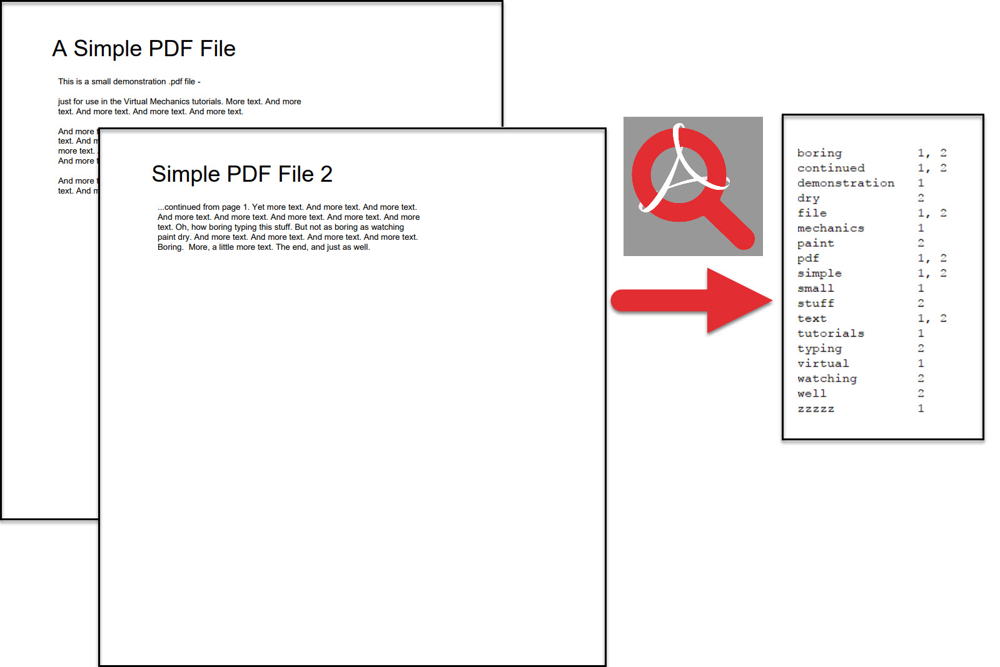

PdfPageLookup
=============

This windows executable allows you to select a pdf file and it will output each unique word in the pdf with every page that word occurs on to your clipboard.

Example:

* select a pdf file
* the program will list all the words
* next ot each word it shows all the pages that word occurs in
* This list is copied to your clipboard, so you can paste it whereever you want

Removing noise words:
* The zip contains a file: noisewords.txt
* You can replace the content of this file with the words you want to omit from the list
* A good source for words to remove in your language can be found here: http://www.ranks.nl/stopwords/

Technology
==========

WPF and i'm using the pdf library IText
